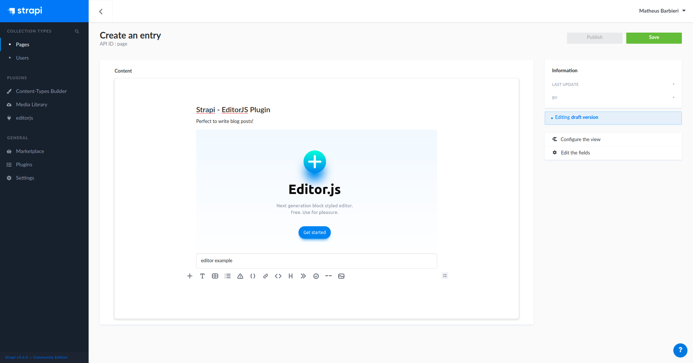

# Strapi - WYSIWYG Replacement for EditorJS

Replace default RichEditor of strapi for [EditorJS](https://editorjs.io/)



### Installing
Enter in strapi root path instalation, and install the package


```bash
# Using npm
$ npm install strapi-plugin-editor

# Using yarn
$ yarn add strapi-plugin-editor
```

After, you will need rebuild the strapi admin using the follow command


```bash
# Using npm
$ npm run build

# Using yarn
$ yarn build
```
